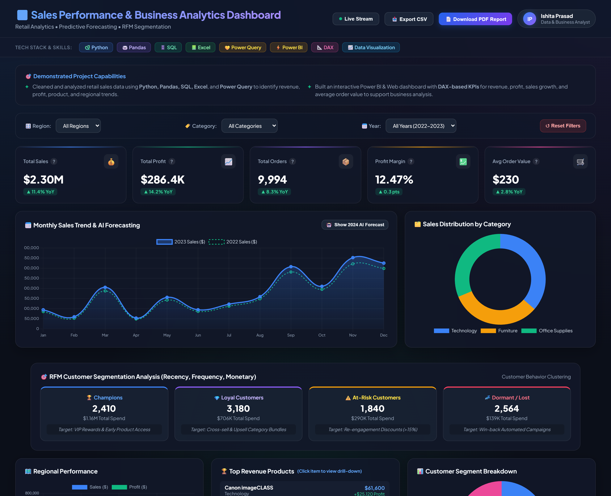

# 📊 Sales Performance & Business Analytics Dashboard

<p align="center">
  
</p>

<p align="center">
  <strong>Executive Retail Analytics, AI Forecasting & RFM Customer Segmentation Solution</strong><br/>
  Created by <strong>Ishita Prasad</strong>
</p>

<p align="center">
  
  
  
  
  
  
</p>

---

## 📸 Executive Dashboard Preview

<p align="center">
  
</p>

---

## 🚀 5 Advanced Analytics Enhancements Included

1. **🤖 Predictive Sales Forecasting Engine:** Toggle interactive 2024 projected sales curves based on historical 2022-2023 retail trends.
2. **🎯 RFM Customer Segmentation (Recency, Frequency, Monetary):** Segment customer base into *Champions*, *Loyal Buyers*, *At-Risk*, and *Dormant* clusters with targeted marketing strategies.
3. **⚡ Live Data Stream Simulator:** Real-time transaction intake engine that dynamically increments orders and sales metrics.
4. **📄 Executive PDF & CSV Data Exporter:** One-click generation of print-ready PDF reports and downloadable filtered CSV datasets.
5. **🔍 Product Drill-Down Modal:** Clickable Top 10 product items revealing detailed sales, net margin %, discount impact, and executive recommendations.

---

## 🎯 Key Project Highlights & Capabilities

- **Data Engineering & Cleaning:** Cleaned and analyzed retail sales data using **Python, Pandas, SQL, Excel**, and **Power Query** to identify revenue, profit, product, and regional trends.
- **DAX-Based KPI Modeling:** Built an interactive Power BI & Web dashboard with **DAX-based KPIs** for revenue, profit, sales growth, and average order value to support business analysis.
- **Interactive Scenario Slicers:** Features dynamic real-time filtering across Region, Category, and Order Year that updates KPI calculations and visualizations instantly.

---

## 📈 Executive Key Performance Indicators (KPIs)

| Metric | Formula / Logic | Business Value | Benchmark Value |
| :--- | :--- | :--- | :---: |
| **Total Revenue** | `SUM(Sales[Sales])` | Overall top-line sales volume | **$2.30M** |
| **Net Profit** | `SUM(Sales[Profit])` | Bottom-line earnings across regions | **$286.4K** |
| **Order Volume** | `DISTINCTCOUNT(Sales[Order ID])` | Transaction volume count | **9,994** |
| **Profit Margin %** | `DIVIDE(Total Profit, Total Revenue)` | Profitability efficiency ratio | **12.47%** |
| **Avg Order Value (AOV)** | `DIVIDE(Total Revenue, Order Volume)` | Mean revenue per order | **$230** |

---

## 📂 Repository Structure

```
sales-performance-dashboard/
├── 📄 README.md                ← Executive project overview & documentation
├── 📁 docs/
│   └── index.html              ← Enhanced Web Dashboard Application
├── 📁 assets/
│   ├── dashboard_preview.png   ← Captured dashboard screenshot
│   └── preview-banner.svg     ← Project SVG banner graphic
├── 📁 datasets/
│   └── sample_data.csv         ← Retail sales dataset
├── 📁 excel/
│   └── sales_analysis.md       ← Excel Pivot Tables & Data Analysis guide
├── 📁 powerbi/
│   ├── dashboard_guide.md      ← Power BI setup & DAX reference
│   └── dax_formulas.md         ← Core DAX formulas reference
└── 📁 tableau/
    └── tableau_guide.md        ← Tableau calculations & worksheets guide
```

---

## 👤 Author & Attribution

**Ishita Prasad**
- 🌐 GitHub Profile: [@ishitapd](https://github.com/ishitapd)
- 💼 Role: Data & Business Analyst
